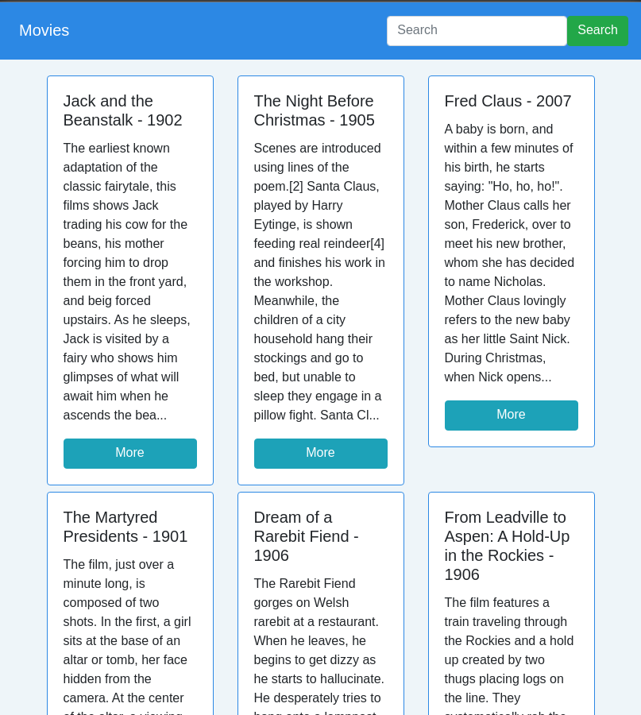

# General desccription - Movies Time

It is a web app that allows users to list, search, add, edit and delete movies. The movies are stored in a database, and the data is imported from a csv ([You can download it here](https://balto-files.s3-us-west-2.amazonaws.com/movie_plots.csv)). It have a responsive design, as shown in the pictures down below.

##### Desktop


##### Tablet


##### Phone


## What technologies it use?
It make use of Django-Postgres, and React-Typescript-Sass(Scss) for your users to allow them to perform operations on the database more easily.

- [Django](https://www.djangoproject.com/)
- [Postgres](https://www.postgresql.org/)
- [React](https://reactjs.org/)
- [Typescript](https://www.typescriptlang.org/)
- [Sass-Scss](https://sass-lang.com/)

## Technologies to implement in the future
The technologies listed down below were not added in this project. Adding this technologies will improve the performance of the web application and make easier the deployment.

- [Docker](https://www.docker.com/)

## How to set up development enviroment 
The information was used for the developer and creator of this project @cjairm. The computer used is a **Debian 10**, but the steps should work for **Ubuntu 16, 18, and 20 **

1. Installing packages from repositories

We will use the Python pacacke manager (pip) to install additional components

*Python 3*
```
sudo apt-get update
sudo apt-get install python3-pip python3-dev libpq-dev postgresql postgresql-contrib nginx
```

2. Preparing DB

**Warning**. This steps will work if you properly install Postgres.

Let's create a database for our project
```
CREATE DATABASE moviesproject
```

Now, We should create a user to use it in Django settings and setting default encoding UTF-8 other proper configuration 
```
CREATE USER moviesprojectuser WITH PASSWORD 'moviesprojectpassword';

ALTER ROLE moviesprojectuser SET client_encoding TO 'utf8';
ALTER ROLE moviesprojectuser SET default_transaction_isolation TO 'read committed';
ALTER ROLE moviesprojectuser SET timezone TO 'UTC';
```

We have to give access to our new user to administer our database
```
GRANT ALL PRIVILEGES ON DATABASE moviesproject TO moviesprojectuser;
```

3. Setting up Django

As we are using Python3 we will upgrade pip and install a tool to run our project in a virtual environment

```
sudo -H pip3 install --upgrade pip
sudo -H pip3 install virtualenv
```

3.1 Creating our virtual environment 
```
cd ./path/to/this/repo
virtualenv movies_django_env
```

3.2 Before we install our project's requirements, we need to activate the virtual environment
```
source ./movies_django_env/bin/activate
```
With this command your prompt should change to indicate that you are now in a Python virtual environment

3.3 With your virtual environment active, install Django, Gunicorn, and the psycopg2 PostgreSQL adaptor with the local instance of pip
```
pip install django gunicorn psycopg2-binary django-cors-headers djangorestframework
```
We are using the default requirements and other two:

	- [Cross-Origin Resource Sharing (CORS)](https://github.com/adamchainz/django-cors-headers#configuration)
	- [Restful API](https://www.django-rest-framework.org/#installation)

You do not need to worry about the settings in Django. If you are following me everithing is setup.

3.4 Runing migrations
```
cd /path/to/django/project/movies_django
python manage.py makemigrations
python manage.py migrate
```
	
4. Import CSV

It's time to add data from the [csv downloaded](https://balto-files.s3-us-west-2.amazonaws.com/movie_plots.csv)
```
COPY movies_movie(release_year,title,origin,director,"cast",genre,url,plot)
FROM '/path/to/the/file/I/downloaded/movie_plots.csv'
DELIMITER ',' CSV HEADER;
```

    Column    |          Type          | Collation | Nullable |                 Default                  
--------------+------------------------+-----------+----------+------------------------------------------
 id           | integer                |           | not null | nextval('movies_movie_id_seq'::regclass)
 release_year | smallint               |           | not null | 
 title        | character varying(100) |           | not null | 
 origin       | character varying(50)  |           | not null | 
 director     | character varying(100) |           | not null | 
 cast         | text                   |           |          | 
 genre        | character varying(50)  |           | not null | 
 url          | character varying(200) |           | not null | 
 plot         | text                   |           | not null | 

5. Run Django Project
We can run with the following command
```
cd /path/to/django/project/movies_django
python manage.py runserver 0.0.0.0:8000
```

Go to your browser and go to **http://localhost:8000/movies/**, and you will see something like this


6. Run React Project
Simple as run the following command
```
npm i
npm start
```

Warning. Both projects have to be running.

## Proposed improvements

- Use Docker
- Create testing units (React and Python)
- Redering improments (React)
- It does not search for similar movies (Python)
- Add pagination (React. Python is already prepared to paginate items)
- I'm using useState. This can be improved by using useReducer
- Change data managing to Context or Redux 
- Improvements in the interface

## Author
Carlos Mendez - @cjairm

### Created on December 2th, 2020 
